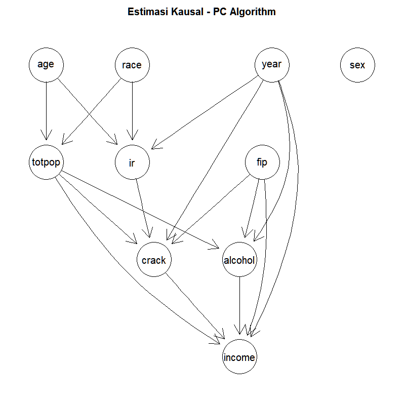
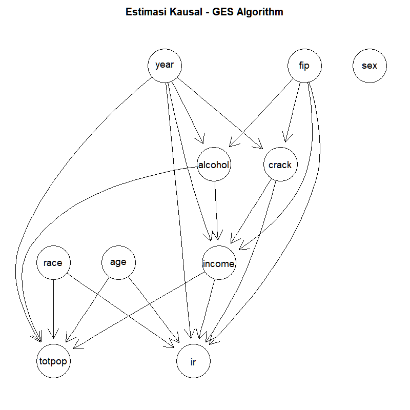

# UTS Pemodelan Kausal (Genap TA 2025/2026)
**Nama:** Khaerul Hadiswara  
**NIM:** 25917025  
**Mata Ujian:** Pemodelan Kausal (B)  
**Program:** Magister Informatika FTI UII  

---

## Jawaban Soal 1
Berdasarkan korelasi kuat antara konsumsi alkohol dan peningkatan risiko kanker paru-paru, peneliti **tidak bisa** langsung menyimpulkan bahwa alkohol menyebabkan kanker paru-paru. Hal ini sesuai dengan prinsip *correlation does not imply causation*.

Korelasi tersebut kemungkinan besar terjadi akibat adanya variabel perancu (*confounder*), yaitu kebiasaan **merokok**. Individu yang sering mengonsumsi alkohol memiliki kecenderungan lebih tinggi untuk merokok, dan merokok adalah penyebab utama kanker paru-paru. Oleh karena itu, peneliti hanya bisa menyimpulkan adanya hubungan asosiatif. Untuk membuktikan hubungan kausal, diperlukan studi lanjutan dengan metode inferensi kausal yang mengontrol efek variabel perancu tersebut.

---

## Jawaban Soal 2
**Contoh Simpson's Paradox:**
Simpson's Paradox adalah fenomena di mana suatu tren yang terlihat pada beberapa kelompok data terpisah menghilang atau berbalik arah (*reverse*) ketika kelompok-kelompok tersebut digabungkan.

Contoh: Terdapat Pengobatan A dan Pengobatan B untuk batu ginjal. Secara data agregat, Pengobatan A memiliki tingkat keberhasilan lebih tinggi daripada B. Namun, saat data dikelompokkan berdasarkan ukuran batu ginjal (batu kecil dan batu besar), Pengobatan B justru memiliki tingkat keberhasilan lebih tinggi di kedua kelompok tersebut. Hal ini terjadi karena ukuran batu ginjal bertindak sebagai variabel perancu (*confounder*).

**Dampak:**
Fenomena ini dapat menyebabkan bias yang fatal dalam pengambilan keputusan. Pengambil kebijakan bisa saja memilih pengobatan yang sebenarnya kurang efektif hanya karena gagal memperhitungkan struktur data dan variabel perancu.

**Kaitan dengan Inferensi Kausal:**
Simpson's Paradox menegaskan bahwa analisis statistik murni tidak cukup untuk menyimpulkan hubungan sebab-akibat. Inferensi Kausal melalui pemodelan graf berarah (DAG) digunakan untuk mengidentifikasi *confounder* mana yang wajib di-*adjust* guna membedakan asosiasi *spurious* dengan efek kausal yang sebenarnya.

---

## Jawaban Soal 3
Diketahui:
*   $P(S)$ = Probabilitas Perokok = 0.30
*   $P(S')$ = Probabilitas Non-perokok = 0.70
*   $P(L|S)$ = Probabilitas sakit paru-paru jika perokok = 0.15
*   $P(L|S')$ = Probabilitas sakit paru-paru jika non-perokok = 0.03

**a. Probabilitas seseorang dipilih acak menderita penyakit paru-paru ($P(L)$)**
Berdasarkan Hukum Probabilitas Total:
$$P(L) = P(L|S) \cdot P(S) + P(L|S') \cdot P(S')$$
$$P(L) = (0.15 \cdot 0.30) + (0.03 \cdot 0.70)$$
$$P(L) = 0.045 + 0.021 = 0.066$$
Jadi, probabilitas seseorang dipilih acak menderita penyakit paru-paru adalah **0.066** atau **6.6%**.

**b. Probabilitas seseorang adalah perokok jika diketahui ia menderita penyakit paru-paru ($P(S|L)$)**
Berdasarkan Teorema Bayes:
$$P(S|L) = \frac{P(L|S) \cdot P(S)}{P(L)}$$
$$P(S|L) = \frac{0.15 \cdot 0.30}{0.066} = \frac{0.045}{0.066} = 0.6818$$
Jadi, probabilitas bahwa orang tersebut adalah perokok adalah **0.6818** atau **68.18%**.

---

## Jawaban Soal 4
**a. Perbandingan PC Algorithm dan GES**
*   **PC Algorithm (*Constraint-based*):** Bekerja dengan melakukan uji independensi kondisional pada data observasional. Algoritma dimulai dengan graf tak berarah penuh, lalu secara berulang menghapus sisi (*edge*) jika variabel-variabel tersebut independen secara kondisional. Selanjutnya, algoritma mencari *v-structures* (collider) dan menerapkan orientasi bersyarat untuk menghasilkan *Completed Partially Directed Acyclic Graph* (CPDAG).
*   **GES / *Greedy Equivalence Search* (*Score-based*):** Bekerja dengan mencari graf yang mengoptimalkan fungsi skor (*scoring criterion*), seperti BIC. Algoritma ini berjalan dalam dua fase melalui ruang Kelas Ekuivalensi Markov: fase penambahan (*forward phase*) tepi untuk meningkatkan skor, dan fase penghapusan (*backward phase*) tepi untuk mengecek apakah skor dapat lebih ditingkatkan.

**b. Kode R dan Pemilihan Parameter**
Berikut adalah potongan kode R yang digunakan untuk mengestimasi graf kausal menggunakan PC Algorithm dan GES (kode lengkap terdapat pada file `analisis_kausal_q4.R`):

```R
# Parameter dan eksekusi PC Algorithm
suffStat <- list(C = cor(df_subset), n = nrow(df_subset))
pc_fit <- pc(suffStat = suffStat, indepTest = gaussCItest, 
             alpha = 0.05, labels = V, verbose = FALSE)

# Parameter dan eksekusi GES Algorithm
score <- new("GaussL0penObsScore", as.matrix(df_subset))
ges_fit <- ges(score)
```

Pemilihan parameter:
*   `indepTest = gaussCItest` (PC): Menggunakan uji Fisher's Z-transform bersyarat karena data berdistribusi Gaussian (numerik kontinu).
*   `alpha = 0.05` (PC): Tingkat signifikansi 5% untuk pengujian independensi statistik.
*   `score = new("GaussL0penObsScore", as.matrix(df))` (GES): Menggunakan metrik *Gaussian L0-penalized* sebagai pendekatan skor BIC yang cocok untuk mengevaluasi model pada data observasional kontinu.

**c. Mengidentifikasi Collider**
Secara teori, sebuah *node* $C$ diidentifikasi sebagai *collider* jika pada tahap pembentukan *skeleton* terdapat pola $A - C - B$ di mana $A$ dan $B$ tidak saling bertetangga, dan $C$ tidak termasuk dalam himpunan pemisah (*separating set*) yang membuat $A$ dan $B$ independen. Jika syarat tersebut terpenuhi, maka panah diorientasikan menjadi $A \rightarrow C \leftarrow B$.

Berdasarkan hasil eksekusi dan estimasi skeleton pada dataset aborsi ini (lihat gambar graf di bawah), **collider yang dapat diidentifikasi secara langsung** antara lain:
*   Pada graf **PC Algorithm**, node **`ir`** adalah *collider* karena ia merupakan titik temu panah yang masuk dari **`age`** dan **`race`**. Selain itu, node **`alcohol`** juga teridentifikasi sebagai *collider* yang menerima panah masuk dari **`year`** dan **`fip`**.
*   Pada graf **GES Algorithm**, node **`income`** bertindak sebagai *collider* karena menerima beberapa panah masuk secara bersamaan, di antaranya dari **`alcohol`** dan **`crack`**.

**d. Interpretasi Hasil Inferensi**
Berdasarkan output eksekusi algoritma PC dan GES pada dataset aborsi:
*   **Arah Panah Tunggal ($X \rightarrow Y$):** Menunjukkan adanya indikasi hubungan kausal langsung yang kuat. Misalnya, pada graf PC Algorithm, variabel `age` memengaruhi tingkat `totpop` secara langsung. Pada graf GES, terlihat jelas bahwa variabel `year` memengaruhi `alcohol` dan `crack`.
*   **Garis Tak Berarah ($X - Y$):** Menandakan arah kausalitas tidak dapat dipastikan akibat keterbatasan *Markov equivalence class*.
*   Secara keseluruhan, meskipun PC dan GES menggunakan pendekatan dasar yang berbeda, keduanya menangkap beberapa struktur hubungan (*edges*) yang serupa pada dataset ini. Ini mengindikasikan bahwa estimasi model kausal cukup robast dan tidak hanya bergantung pada satu jenis algoritma pencarian.

Berikut adalah hasil visualisasi pemodelan graf berarah (DAG):

**1. Output PC Algorithm**


**2. Output GES Algorithm**

